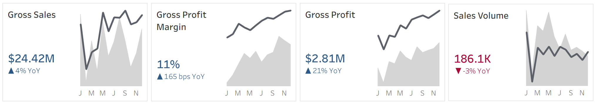
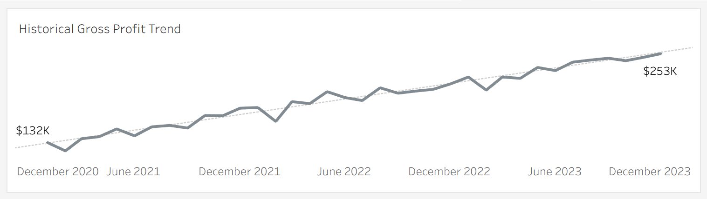
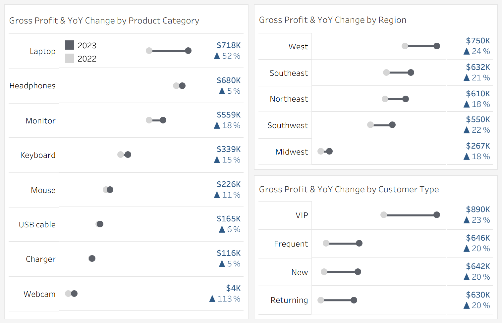
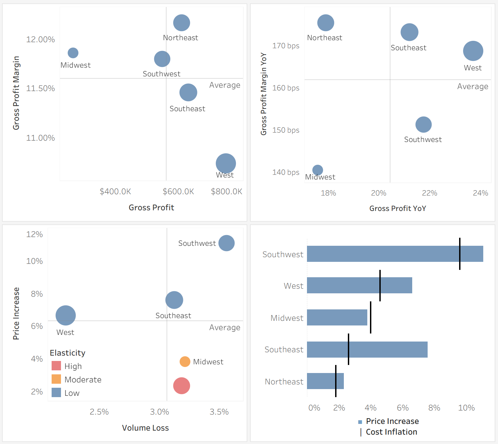
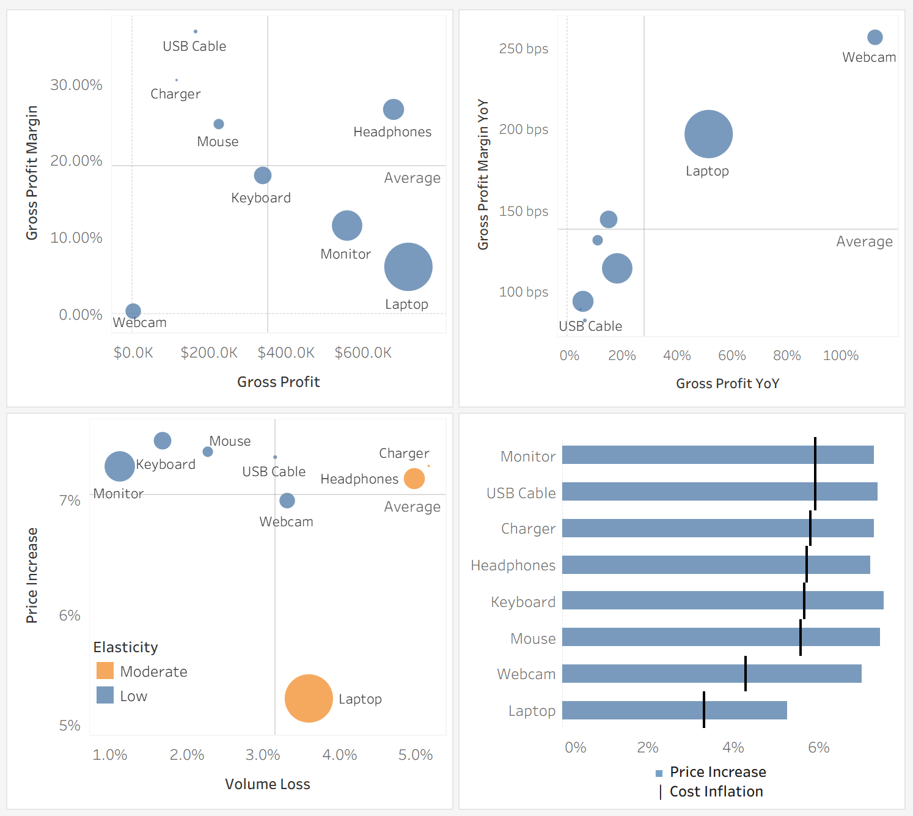

Analysis for an electronics retailer established in 2021, specializing in computers and computer accessories. The company initially entered the market with below-industry margins to rapidly build customer base and market presence, and is now transitioning to more sustainable margin levels. This analysis evaluates 2023 performance across product categories, regional markets, and customer segments to identify where margin normalization succeeded, which areas require strategic adjustments, and how to optimize profitability going forward.
### Interactive Dashboard supporting the analysis can be found [**here**](https://public.tableau.com/shared/794ST28HM?:display_count=n&:origin=viz_share_link).

## Key Takeaway: 2023 Strategic Priorities & Actions Summary

**Profit growth is being driven by pricing discipline and margin expansion, not volume**: 2023 delivered strong profit growth (+21% YoY) despite declining unit volumes (-3%), confirming that customers accept normalized pricing and that margin expansion (165 bps) is the primary growth lever. This validates the shift from growth-stage pricing to sustainable profitability.

**1\. Focus resources on high-leverage products, exit structurally broken categories**
* **Insight:** Laptops, headphones, and monitors generate \~70% of total profit, where small pricing or cost changes have outsized P\&L impact. Conversely, webcams remain structurally unprofitable despite aggressive pricing and margin improvement.
* **Recommended Actions:** Protect volume in laptops and avoid further aggressive pricing as elasticity limits approach. Invest in monitors and keyboards, which show strong pricing power and improving unit economics (another 1-2% pricing with similar volume impact is +$140-280K profit potential). Maintain high-margin accessories as margin stabilizers, not growth engines. Consider an exit or wind-down of webcams and focus on higher-return categories.

**2\. Regional performance differences are driven by pricing power and cost control, not product mix**
* **Insight:** With nearly identical product mix across regions, performance gaps are explained by pricing execution and cost inflation. The West demonstrates the optimal balance, while the Southwest faces a cost crisis that threatens long-term competitiveness.
* **Recommended Actions:** Use the West as the execution benchmark for balanced pricing and retention. Make cost reduction the top priority in the Southwest (supplier renegotiation, logistics, operational audits) as it is potentially our largest opportunity (+$240K profit). Replicate Northeast cost-management practices across regions. In the Midwest, focus on volume recovery through bundles and targeted offers rather than price increases.

**3\. VIP customers are one of the biggest untapped margin opportunities**
* **Insight:** VIPs deliver 32% of total profit, show the lowest price sensitivity, and have the strongest retention, yet current pricing remains conservative, leaving meaningful margin on the table.
* **Recommended Actions:** Test incremental VIP price increases (+1–2% pricing: +$13-27K profit) with close retention monitoring. Reinforce value with VIP-exclusive benefits (early access, premium support, exclusive SKUs). Expand conversion programs to move Frequent Buyers into VIP status, where a 20% uplift could generate \~$130K incremental profit.

**4\. Growth depends on improving customer lifecycle economics, not acquisition alone**
* **Insight:** New and Returning customers are the most price-sensitive, least loyal, and most expensive to serve. Profitability improves materially only once customers transition into Frequent and VIP segments.
* **Recommended Actions:** Improve onboarding and early engagement for New customers to accelerate conversion. Hold pricing steady for Returning customers and use targeted, personalized incentives to reduce churn.

## **2023 Performance Overview : How did we do in 2023?**

Both sales and profit increased in 2023 compared to 2022, with total sales up 4% YoY and gross profit rising sharply by 21% YoY. While sales growth was modest, the disproportionate increase in profit reflects strong margin expansion (165 bps YoY) and improved profitability throughout the year. Sales growth was driven primarily by higher average selling prices rather than increased volume. While unit volumes declined modestly (-3% YoY overall) across all products, the improvement in profitability demonstrates effective pricing discipline, and an overall better cost management, and successful margin expansion. 

We can see this on the longer-term trends too: both sales and profit have trended upward consistently from 2021 through 2023, indicating sustained business growth. This reflects the **successful transition from growth-stage pricing to sustainable margin levels**, proving customers value our products enough to absorb normalized pricing with only a small volume loss. (Note for future analysis: sales trends exhibit clear seasonality. February is consistently the weakest month, while August and December are the strongest.)

Three areas stand out as our strategic anchors: Laptops generate the most profit in 2023 after demonstrating a successful margin expansion (+197 bps), VIP customers deliver outsized profitability with minimal price sensitivity, and the West region shows balanced execution that other regions should emulate. Protecting and optimizing these high-performing areas is critical to sustaining overall growth.

## **Product performance is driven by margin potential and volume leverage**

**Key Takeaway:** Product strategy must be tiered by P\&L impact and margin potential. Laptops, headphones, and monitors generate $1.96M (70% of total profit), making them high-leverage categories where small changes create large profit impact. Keyboards merit investment given a strong margin trajectory. High-margin accessories (cables, chargers, mice) should be maintained as margin stabilizers. Consider exiting webcams to redeploy resources.

### 2023 Product Category Summary:

Gross profit varies from $4K (webcams) to $720K (laptops). Products range from 0.28% margin (webcams) to 36.76% margin (USB cables), with margin improvements spanning 83 bps to 257 bps. Key drivers:

* **Margin levels vary dramatically:** 0.28% (webcams) to 36.76% (USB cables), a 36pp spread  
* **Volume loss is nearly uniform:** \-1.1% to \-5.2%, reflecting consistent pricing discipline across products  
* **Cost inflation ranges widely:** 0.3% (chargers) to 4.8% (monitors)—a 16x difference  
* **Pricing strategies varied moderately:** 5.3% to 7.5%, with most products clustered around 7%

This confirms that product-level profitability is driven by structural margin potential and cost dynamics, not just revenue scale. High-revenue categories with thin margins (laptops at 6%) require different strategies than low-revenue, high-margin categories (USB cables at 37%).

### Detailed Product Strategies:

**Laptops (high leverage, margin fragile):**

* Largest profit driver with $720K gross profit (26% of total profit) but lowest margin (6.09%). However, exceptional margin improvement (+197 bps, best in portfolio) on minimal cost inflation (+0.4%) shows successful pricing execution (+5.3%) with moderate volume loss (-3.6%). High leverage: 1% price change \= \~$120K profit impact vs. \~$4K for accessories.  
* **Action:** We already implemented +5.3% pricing in 2023 (cumulative pricing fatigue possible) and since Laptops represent a quarter of the profit, it is a high concentration risk if volume collapses. Protect volume and avoid further aggressive pricing, as price elasticity\* may approach limits. Explore alternative strategies, such as accessory bundles that grow margins without base price risk.

\* Elasticity = % change in volume / % change in price
- Low (|elasticity| < 0.5): customers are insensitive to price changes
- Moderate (0.5 ≤ |elasticity| ≤ 1.0): customers are somewhat insensitive to price changes
- High (|elasticity| > 1): customers are very sensitive to price changes

**Headphones (stable, high-margin):**

* High profit ($680K, 24% of total) with strong margins (26.63%) but modest growth (+5.5% profit, \+94 bps margin).  
* **Action:** Maintain current strategy as this category is stable and profitable. Volume loss and moderate elasticity indicates pricing ceiling may be reached.

**Monitors (strong momentum):**

* Second-largest profit driver with $559K (19% of total profit) and moderate margins (11.5%). Strong performance: \+18% profit growth, \+115 bps margin improvement. Facing highest cost inflation (+4.8%) but pricing (+7.3%) successfully covered it with minimal volume loss (-1.1%), indicating low price sensitivity.  
* **Action:** Sustain momentum while managing cost pressure through supplier negotiations. While low elasticity suggests pricing power exists, also focus on cost containment to protect strong volume retention.

**Keyboards (rising star):**

* Moderate profit ($339K, 18% margin) but strong margin improvement (+144 bps). Solid profit growth (+15%), pricing (+7.5%) well-absorbed with minimal volume loss (-1.7%) showing low price sensitivity.  
* **Action:** Invest in marketing to capitalize on strong margin momentum and low price sensitivity. This category shows both pricing power and improving unit economics with a potentially high ROI.

**Mice (steady performer):**

* Moderate profit ($226K) with high margins (24.76%) and strong margin improvement (+132 bps) despite cost inflation (+3.2%). Pricing (+7.4%) managed well with moderate volume loss (-2.3%).  
* **Action:** Maintain current strategy. Solid performer with improving margins. Explore bundling with laptops/keyboards to drive volume.

**USB Cables & Chargers (high-margin stabilizers):**

* Highest margins in portfolio (36.76% cables, 30.43% chargers) but low absolute profit ($165K cables, $116K chargers) with minimal growth (\~6% and 5%). Stable cost inflation (+2.6% cables, \+0.3% chargers) with strong pricing (+7.4% and \+7.3%), but volume losses (-3.2% cables, \-5.2% chargers) indicate growth exhaustion.  
* **Action:** Maintain as portfolio stabilizers providing reliable margin contribution. Explore bundling opportunities but avoid aggressive standalone volume-push strategies that risk margin erosion without meaningful profit upside.

**Webcams (structurally unprofitable):**

* While the category recovered from negative profits in 2022 to barely-positive in 2023 (+$4K, \+257 bps margin gain to a 0.28% margin), it remains structurally broken and diverts resources from higher-return opportunities**.** Even with a \+7.0% pricing, webcams do not achieve viable margins and generate 180x less profit than laptops.   
* **Action:** Consider exiting category to reallocate resources. Webcams divert resources from higher-return opportunities and cannot achieve profitability even with aggressive pricing. Exiting has a -$4K direct profit impact, but frees up significant resources (inventory, shelf space, management attention, supplier relationships) for higher-impact opportunities.

## **Regional performance is driven by pricing power**

**Key Takeaway:** Regional pricing must reflect local price sensitivity. West demonstrates optimal execution with moderate pricing and strong retention, should be used as a benchmark. Northeast has strong cost management that should be replicated in other regions. Southwest can absorb 12-15% total pricing but needs urgent cost reduction. Midwest needs volume recovery.

### 2023 Regional Summary:

Profit growth varies 18%–24% while margin improvement varies 141–176 bps across regions. Product mix is nearly identical (laptop mix ranges only 44–52%), explaining just \~25% of margin differences. The real drivers are:

* **Unit price increases vary dramatically:** 2% (Northeast) to 11% (Southwest), a 9pp spread.  
* **Volume loss is nearly uniform:** \-2.2% to \-3.6%, which reflects a similar customer response despite wildly different pricing  
* **Cost inflation ranges widely:** 1.82% (Northeast) to 9.58% (Southwest)—a 5.3x difference

This confirms regional pricing strategy, not category mix, explains performance differences. One-size-fits-all pricing leaves money on the table in low-sensitivity regions and destroys volume in high-sensitivity regions.

### Detailed Regional Strategies:

**West (execution benchmark):**

* Largest market with $7.0M sales, $750K profit, and best profit growth (+23.7%). Balanced with a moderate pricing (+6.6%), low elasticity, best volume retention (-2.2%), and manageable cost inflation (+4.59%).   
* **Action:** Maintain current strategy.

**Southwest (cost crisis):**

* Moderate $550K profit with 11.8% margin. Extreme cost inflation (+9.6%, 5x higher than Northeast) forced aggressive pricing (+11.1%, highest in portfolio). While low elasticity suggests customers can absorb current pricing, the cost structure is unsustainable and will eventually erode competitive position.  
* **Action:** Cost reduction is the priority. Investigate supplier contracts, logistics inefficiencies, and operational differences vs. Northeast. Reducing 9.6% inflation to ~4.5% on $4.7M Southwest sales ≈ +$240K profit.

**Northeast (cost management benchmark):**

* Moderate profit ($600K) with the highest profit margin (12.2%) across regions. Achieved best margin improvement (+176 bps) through superior cost control (+1.82% cost inflation, lowest in portfolio). However, high price elasticity limits pricing power: a low \+2.3% pricing still resulted in \-3.2% volume loss.  
* **Action:** Study and replicate cost management practices in other regions. Hold pricing at current levels, since further increases will accelerate volume loss.

**Southeast (balanced performer):**

* Delivered strong performance with moderate margins (11.5%), $632K profit (second-best across regions) and \+21.2% growth by leveraging low price elasticity to implement aggressive \+7.6% pricing.  
* **Action:** Continue current strategy

**Midwest (volume recovery needed):**

* Smallest market ($2.3M sales, $267K profit) with moderate pricing (+3.8%). However, moderate elasticity still led to a \-3.2% volume loss.  
* **Action:** Focus on volume recovery through targeted marketing, bundles, or selective promotions. Improve margins through cost reduction, not price increases, since customers won't absorb more.

## Maximize VIP Value, improve onboarding, drive conversion

**Key Takeaway:** Focus on maximizing VIP value, accelerating Frequent Buyer to VIP conversion. Raise VIP prices and offer exclusive products to capture untapped margin. Retain Returning customers with targeted incentives and personalized offers, while holding pricing steady to prevent churn. Improve onboarding for New customers and drive rapid conversion to Frequent/VIP to ensure profitable growth. Across all segments, prioritize pricing strategy, lifecycle management, and targeted retention and conversion programs to optimize revenue and profitability.

### 2023 Customer Type Summary:

Profit and margin vary meaningfully across customer segments despite nearly identical product mix and per-order characteristics. This means that profitability comes from tailoring pricing, retention, and conversion strategies to each customer type.

* **Profit contribution:** VIP $890.5K, Frequent $646K, Returning $630K, New $642K.  
* **Price elasticity varies sharply:** VIPs and Frequent buyers are price-insensitive, New buyers show moderate sensitivity, and Returning customers are very price-sensitive.  
* **Price and cost inflation diverge by segment:** Returning customers show \~50% lower price and cost inflation due to discount-driven behavior. VIPs have conservative pricing (+6.8%) leaving margin on the table, while New customers face high cost inflation (+6.02%).  
* **Retention patterns differ:** VIPs are the most loyal (-1.5% volume loss), Frequent and Returning have moderate retention, while New customers are the hardest to retain with \-4.2% volume loss in 2023\.

### Detailed Customer Strategies:

**VIP Customers (highly profitable, price-insensitive, and loyal):**

* Largest profit contributor at $890.5K (32% of total) with exceptional loyalty (-1.5% volume loss, best retention) and low price elasticity. Current \+6.8% pricing is conservative given their low sensitivity, leaving margin on the table.  
* **Action:** Implement tiered pricing testing: raise VIP prices in \+1-2% increment (on $890.5K profit, +1.5% average pricing ≈ +$13K), while closely monitoring retention. Pair pricing with VIP-exclusive benefits (early access, premium support, exclusive products) to reinforce value perception and justify increases. VIP customers generate 32% of profit, therefore even small retention losses (5% churn \= $45K profit loss) can outweigh pricing gains. Test cautiously and be prepared to roll back if elasticity increases.

**Frequent Buyers (loyalty and moderate pricing tolerance):**

* Low elasticity, strong margins (+176 bps), good retention. Not fully capitalizing on upsell potential.  
* **Action:** Prioritize conversion to VIP status via targeted offerings. A 20% conversion could yield \~$130K incremental profit.

**Returning Customers (price-sensitive discount-driven repeaters):**

* High elasticity (-1.06), half the price and cost inflation, vulnerable to competitive pressure, low retention.  
* **Action:** Hold pricing at \+3–4%, implement targeted retention incentives and personalized offers, prevent further volume erosion.

**New Customers (expensive to acquire, hard to keep):**

* Highest cost inflation (+6.02%), worst retention (-4.2%), $642K profit but high acquisition cost.  
* **Action:** Enhance onboarding, target high-potential customers, and convert them quickly into Frequent or VIP buyers.
